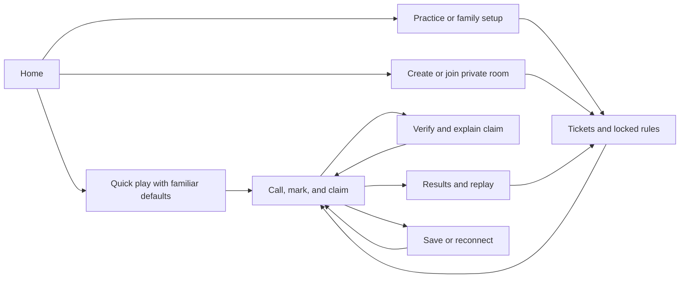

# Complete Tambola Game: implementation and release plan

**26 September design revision:** the user's APK trial identified major UX friction. [GAMEPLAY_REDESIGN.md](GAMEPLAY_REDESIGN.md) is the active product brief, competitor-review evidence, screen audit and iteration sequence. Prioritize one-action fast play, familiar prizes, complete visible owned hands, and disjoint physical ticket strips before further release packaging. Earlier ticket-carousel and long setup layouts are superseded.

Date: 25 September 2026. Development branch: `shrey/full-tambola-game`.
Starting commit: `76b6a2c5da5a4729a7dbcd28fac83878780ac9d8`.
Status: execution in progress. The internal Android alpha includes offline/family play, native private rooms against a locally tested service, saved appearance, original offline music/effects, selectable avatars, verified-win celebrations, English/Hindi data disclosure and private-room invitation links. Public link verification still requires the actual hosted domain and signing identity. See [FULL_GAME_PROGRESS.md](FULL_GAME_PROGRESS.md) for current evidence; the production release gates below remain unchanged.

## 1. Intended outcome

Deliver a standalone Android app in which people can set up a round, receive digital tickets, hear number calls, mark tickets, claim prizes, see verified winners, and play again without paper tickets or another messaging app. Make the experience warm, legible, responsive, and enjoyable through thoughtful motion, multilingual calling, gentle music, and tactile feedback.

The production deliverable includes a signed installable APK, a Play-ready AAB, tested source, operating documentation, and a working hosted service for private online rooms. An offline beta is an intermediate milestone, not completion of the whole proposed scope. A Play listing is a separate distribution step; an AAB alone does not establish store approval.

Confirmed scope: the user selected all three playing modes and free social play with points and badges on 25 September 2026. Remaining implementation defaults are stated below and can be refined during development.

- Include offline practice, shared-device family play, and private online rooms.
- Free social play with points and badges. Monetary prize tracking, payments, wallets, entry fees, and cash settlement are outside the confirmed scope.
- Working title: **Tambola Together**. New package: `io.github.sbshrey.tambola.game`; final branding can change before release.
- Support Android 8/API 26 onward, subject to the selected dependencies' actual minimums. Target at least API 36 for the current Play requirement and recheck at release.
- English and Hindi interface resources; English, Hindi, and Hinglish number calling.
- No account form for offline play. Online guests choose a display name and preset avatar.
- Private rooms initially support 2–32 players, 1–6 tickets per player. Treat these as tested product limits, not a promise of unlimited scale.

## 2. Repository baseline and reuse

| Existing material | Reuse approach | Gap for the new app |
| --- | --- | --- |
| Web caller in `src/`, version 1.6.0 | Preserve its behavior; use draw, storage, language, and sharing tests as reference fixtures | No playable tickets or shared rooms |
| Java Android IME in `android-keyboard/`, version 1.3.1 | Reuse release-script patterns, asset packaging, and lessons from lifecycle tests | Keyboard UI and state model do not provide the requested game |
| 270 prerecorded clips in `audio/`, `audio/hi/`, `audio/hinglish/` | Package the original clips with manifest/hash verification; audition in the new mix | Add short tutorial, countdown, and celebration cues only where useful |
| `src/call-phrases.js`, `src/languages.js`, and `scripts/calls.mjs` | Export versioned language/phrase fixtures instead of maintaining separate handwritten catalogs | Native UI translations and accessibility labels |
| `PrizeCatalog.java` and `android-keyboard/SCHEMES.md` | Preserve the 41 names as a reference for configurable variants | Names and minimum call counts are not executable claim definitions |
| Existing Node tests and Android JVM/instrumented tests | Keep existing products passing; add independent new-game tests | Ticket correctness, automatic verification, online fairness, lifecycle recovery |

Create the new app under `full-game/`, with its own Gradle build and application ID. The existing keyboard must remain independently installable. Do not copy its microphone permission, input-method service, signing identity, or manual two-winner limitation into the new game by default.

Verified during planning: 69 web tests passed and the static build succeeded. Existing Android `testDebugUnitTest` and `lintRelease` succeeded; Gradle reused current test outputs containing 24 tests with zero failures, and release lint reported no issues. No new physical-device, instrumented, or hosted multiplayer validation occurred in this planning pass.

Local tools observed: Node 24.21.0, JDK 17, and Android platforms 30/34/35. API 36 tooling must be installed for the new target. An OpenAI key is present in the process environment; its value was not read or printed, and paid API access was not tested.

## 3. Player experience

| Mode | Complete flow | Acceptance example |
| --- | --- | --- |
| Practice | Tap Quick play for three tickets, two labelled computer players, assisted marking, common prizes and five-second calls; optional setup offers 1–6 tickets | A fresh installation starts in one action and completes a round in airplane mode |
| Family on one device | Add 2–8 local players; show only the current player's complete hand; pause and hide the hand before passing the device | Every player can mark and inspect wins without paper or a second phone |
| Private online room | Create/join using room code or invite link; agree rules; ready up; receive tickets; play; reconnect; view shared results | Two physical phones on different networks finish the same round |

Computer players use the same tickets and called-number information as humans. They never inspect future draws. Their visible response timing is configurable and deterministic in tests; no paid AI inference is needed for bots.

Core screens:

1. Optional interactive tutorial; core play never requires it.
2. Home with prominent Quick play or Resume, plus family/custom play and private rooms.
3. Optional setup with players, ticket count, call pace, marking assistance, and rule previews.
4. Lobby with room code, share action, readiness, connection state, and host controls.
5. Ticket deal preview with clear ownership and a locked-rules summary.
6. Stable game table with a large current number, recent calls, compact prize rail, all 1–6 owned tickets and large play/dab actions. No scrolling or ticket switching during play.
7. Full 1–90 board and chronological call history.
8. Prize inspection with the locked rule, matching/missing numbers, verified result and a readable explanation.
9. Winners and results with tied winners, badges, round history, and rematch.
10. Settings/help with language, voice/music/effects volumes, haptics, reduced motion, accessibility, data deletion, and credits.



## 4. Rules that must be explicit before UI polish

### Tickets and draws

- Every ticket is a 3×9 grid with exactly 15 unique numbers, exactly five per row, and one to three per column.
- Column ranges are 1–9, 10–19, ..., 70–79, 80–90; populated cells ascend from top to bottom in each column.
- Generate constrained row/column layouts with bounded backtracking, then assign numbers. Never use an unbounded retry loop.
- Reject duplicate complete tickets within one round. Keep a canonical ticket fingerprint.
- Deal each new 1–6 ticket hand from one randomized six-ticket strip. No number repeats within a hand; six tickets cover 1–90 exactly once. Different players can share numbers. Preserve existing saved hands without silently redealing them.
- Shuffle once using secure randomness and unbiased bounded selection. Keep future draws private. Inject a deterministic random source only into tests and explicitly marked practice replay.
- Online ticket allocation and draw order are server-owned. Ticket ownership and rules lock before the first draw; no mid-round rerolls or competitive late joins.
- Draws are unique, numbered events. Pause/resume never redraws or skips a number. Only practice permits undo; any undo recomputes dependent claims and invalidates derived results.

### Initial verified prize set

| Rule | Exact proposed definition |
| --- | --- |
| Early five / Early ten | Any five / ten numbers on one ticket have been called |
| Top / Middle / Bottom line | All five populated cells of the selected row have been called |
| Four corners | Leftmost and rightmost populated cells of the top and bottom rows; show these four cells in the rule preview |
| Full house | All 15 numbers on one ticket have been called |
| House 1 / 2 / 3 | Successive groups of newly completed tickets; all tickets completing on the same draw share that rank; already awarded tickets are excluded from later house ranks |
| Custom pattern | A rule composed from displayed ticket positions or a count predicate, with AND/OR composition, a plain-language description, and positive/negative examples |

The existing 41 names include regional variants and multi-ticket concepts. Do not infer their meaning from their names. Implement a bounded rule builder that can express row, populated-cell position, column/range, count, and explicitly selected multi-ticket predicates. Each saved rule has a version and preview. Names without a configured definition cannot be advertised as automatically verified. If a requested regional rule cannot be expressed, record that as a gap and extend the rule engine with tests before enabling it.

### Marking, claims, and ties

- The 26 September gameplay reference changes the next version to direct manual number taps, with a large optional action for the current called number when six-ticket targets are small. Uncalled numbers cannot be marked. See [the reference review](REFERENCE_GAMEPLAY_REVIEW.md).
- Assisted marking is a clearly labelled room setting, fixed before play; it must not silently vary between online players.
- One Claim action evaluates all owned tickets and enabled schemes. Verification checks submitted marks against immutable owned tickets and the authoritative called prefix; a client's claimed winner flag is never accepted. Human awards require this action in the new mode. Alpha14 and older saved rounds retain their automatic-award rules.
- Claims received during the same called-number window share a prize, independent of arrival order. Once the next number is called, that award is closed. Record all winning tickets and deduplicate player points; do not inherit the old two-winner limit. This still has a network deadline, so disclose late/reconnecting behavior and validate it on real networks before release.
- Anchor online claims to the round ID and called-number index. An unrelated presence/revision update must not reject a claim for the current call. Unknown responses retain their idempotency key; late claims receive an explicit outcome rather than silently targeting a newer call.
- Keep replayable successful claim evidence. Award winners may grow within the current tie window and become final when it closes. Duplicate requests return the same outcome.
- Default round ends after the selected final house award resolves. Also support an explicit 90-call round. Host cancellation is shown as cancelled with partial results, not a completed game.
- Number 90 and a terminal-house claim retain their final claim window. The next timer boundary settles it without drawing a 91st number. Rematch creates a new round ID.

### Points, badges, and history

- Proposed default points: Early five 10, Early ten 20, each line 15, corners 15, and Full house 100. In a three-house round, use 100/75/50 for house ranks instead of also awarding the standalone Full house points. Custom-rule points are visible and locked in the lobby.
- Tied winners each receive the full advertised points. A player earns points once per rule/rank even if several of their tickets qualify; results still show every winning ticket. Enforce a common ticket allowance within an online room.
- Keep practice, computer-opponent, family, and online histories separate. Show rounds completed, verified awards, and personal bests without presenting local results as a global leaderboard.
- Initial badges are simple, explainable milestones such as First round, First full house, and Five completed rounds. Award them idempotently from completed results; cancelled rounds do not advance completion badges.
- History shows the date, mode, rules, called order, winners, and replay/rematch options. Shared result cards contain only the player information the user chooses to include.

## 5. UI, motion, and sound direction

Current visual direction: a deep green game table, warm paper tickets, mint dabs and amber accents for the latest call and verified wins. Reuse the light/dark theme, spacing, typography, sheets and ticket components. Keep prose out of the live table and put detailed rules/settings in secondary views. Decorative art never replaces native numbers, tickets, navigation or other critical information.

| Moment | Treatment | Behavior constraint |
| --- | --- | --- |
| Ticket deal | Short staggered slide/fade | Skippable; ownership visible immediately |
| Number reveal | Ball roll/scale settling into the current-number card | Result is already committed; animation never chooses it |
| Ticket mark | Ink dab/check pulse with light haptic | Immediate feedback; no delayed interaction |
| One number away | Subtle border accent and readable label | Avoid flashing or constant distraction |
| Verified win | Brief confetti, badge reveal, warm chime | Dismissible; does not cover required controls |
| Reconnection | Calm status banner and progress state | Never replay a backlog of sound or celebrations |

Use Compose animation/Canvas for motion and vector geometry. Standard transitions should last roughly 150–250 ms, number reveals 350–600 ms, and celebration overlays no more than about two seconds. Respect system animation settings and expose reduced motion. Measure on an agreed midrange reference phone instead of judging emulator smoothness.

Accessibility requirements include TalkBack labels for number/row/mark state, a logical traversal order, non-color status cues, contrast checks, and independent sound/haptics toggles. The next manual table needs direct number taps plus accessible actions for missed called numbers and a large current-number action. Six complete ticket grids cannot provide 48dp cells on every phone; keep the main Claim/navigation actions at least 48dp and explicitly evaluate compact number targets. All owned cards remain visible; test number legibility and actual TalkBack use separately from screen-bound assertions. Extreme window sizes require explicit limits rather than a universal readability claim.

Reuse the existing voice clips. Keep speech, music, and effects on separate volume controls; duck music under calls; handle audio focus, Bluetooth changes, phone calls, and silent settings. Playback failures never stop game progression. Optional background playback uses the correct Android service/notification behavior; otherwise pause offline autoplay when backgrounded. Online rounds continue on the server and resync on return.

## 6. Asset production and OpenAI use

OpenAI is a development-time asset tool for this app. An installed game must not need the developer's key or a live model response to draw, mark, verify, or finish a round.

1. Inventory and hash the existing 270 recordings; reuse satisfactory clips.
2. Write a small asset brief: app icon, home illustration, four lightweight table backgrounds, eight avatar concepts, and prize badges. Produce a small consistent sample set before a full batch.
3. Use the image-generation API for suitable illustrations and transparent raster art; hand-author scalable UI/vector elements. Optimize images and provide density variants where needed.
4. Use text-to-speech for a bounded set of onboarding/countdown/winner-category phrases. Audition English/Hindi pronunciation and level-match with existing recordings. Preserve a clear AI-voice disclosure.
5. Compose original short instrumental loops and synthesized UI effects using deterministic audio tooling, or use assets with documented redistribution rights. The reviewed speech endpoint is not a verified music-generation pipeline; music must not depend on treating TTS as one.
6. Store model, sanitized prompt, generation date, content hash, asset usage, and license/provenance notes in an asset manifest. Human listening and visual review remain required.
7. Keep credentials in local/server secret storage. Inspect release APKs and source for leaked secrets. Never put the key in Android resources, build constants, logs, screenshots, or committed environment files.
8. Add dry-run estimates, batch limits, caching, and no silent billable retries. Initial generation envelope: at most 12 image candidates and 20 short voice phrases, with a proposed US$10 hard session cap enforced by the tool. If a verified estimate would exceed that cap, reduce the batch; account access and prices are checked when generation begins.

No API calls were paid for during planning. Successful key presence is not evidence of available image-model access or billing.

## 7. Architecture and repository layout

Recommended implementation: **Kotlin + Jetpack Compose** for Android, one pure Kotlin rules module shared with a **Ktor/JVM** room service, and **PostgreSQL** for server persistence. This keeps ticket and claim rules in one language and one implementation. A browser wrapper would not give the same native accessibility, animation, lifecycle, and audio integration; a full 3D engine adds little to this predominantly 2D interface.

Start with four modules; use packages for features and split further only when a concrete dependency or build problem justifies it.

```text
full-game/
  app/                    Android Compose screens, navigation, ViewModels
  domain/                 Pure Kotlin tickets, rules, round state machine
  protocol/               Versioned commands, events, and public DTOs
  server/                 Ktor endpoints, room coordinator, PostgreSQL
  fixtures/               Shared rules/ticket examples and replay traces
  assets/                 New approved art/audio plus provenance manifest
  tools/                  Asset import/generation and release scripts
  ops/                    Container setup, migrations, health checks, runbooks
  gradle/                 Pinned version catalog and dependency verification
docs/
  FULL_GAME_PLAN.md
  FULL_GAME_PROGRESS.md
```

Android uses immutable UI state through ViewModels/StateFlow, Room for durable rounds/history, and DataStore for settings. Keep screens free of random selection, persistence, and network mutations. A `GameRepository` exposes local and online implementations to the same presentation layer. Local transitions use the shared domain engine; online commands go to the server, and the client displays confirmed state with a visible pending/disconnected state.

The service accepts HTTPS commands and streams committed events over authenticated WebSockets. The protocol module contains only public DTOs; it must never serialize future draw order, private session material, or other players' private ticket data by accident. Use versioned snapshots plus an ordered event log rather than an elaborate general event-sourcing framework.

Proposed entities: `GuestSession`, `PlayerProfile`, `Room`, `RoomMember`, `Round`, `RuleSet`, `Ticket`, `DrawEvent`, `Award`, `CommandReceipt`, and `RoundSummary`. Every mutable online aggregate carries a revision; rules, tickets, and awards retain the versions needed to reproduce a result. Android save/schema migrations have real migration fixtures.

## 8. Multiplayer correctness and recovery

- Generate a cryptographically random guest session token; store only its hash on the server, enforce expiry/revocation, and protect device storage. Display names are not identities. Reinstallation does not promise guest-account recovery.
- A join code finds a room but is not an authorization token. Rate-limit discovery/joins, expire inactive rooms, and support a lobby lock and host removal before the round starts.
- Validate role, membership, round status, expected revision, and idempotency key for every command. Bound all text, ticket counts, room sizes, frame sizes, and request rates.
- Draw, award creation, command receipt, and event-log append occur in one database transaction with per-round serialization. Publish only after commit; use an outbox so restarts cannot lose committed notifications.
- A persisted `nextDrawAt` and exclusive database ownership of each transition drive online autoplay. The initial service uses short row transactions with `FOR UPDATE SKIP LOCKED` rather than a separate renewable lease. Duplicate workers and a restarting process cannot produce two calls. A late worker schedules the next interval without flooding clients with catch-up calls. Measure and revisit the bounded batch size under the planned load.
- Clients acknowledge event sequence numbers. On reconnect, request missing events or a versioned snapshot; ignore duplicates and reject stale state. Do not queue offline draw/award commands and replay them blindly.
- An offline player can inspect cached tickets/history and local marks, but online results require authoritative resync. Eligibility is still computed server-side while they are disconnected.
- Keep host role and game authority separate: the service continues calling after a host disconnects. Transfer host controls through a persisted, deterministic succession rule after a visible grace period; never create a second round authority.
- Prevent future-number access even for the host. Commit a hash of the secret shuffled order plus a nonce before the round, then reveal them after completion for optional replay verification. This detects later order changes; it is not a claim of externally audited randomness.
- Use TLS, redacted structured logs, database backups, guest/data deletion, and explicit retention. Initial service behavior: rooms close 24 hours after creation; their records and audits are removed 30 days after that expiry. Expired guest sessions/profiles are removed after 30 days. Local history remains until deleted. Explicit profile deletion now removes memberships and redacts identity fields across current/archived records and retry receipts; see [the implemented policy](../full-game/server/PROFILE_DELETION.md). Reconcile retention with the final privacy notice, prove large-history deletion behavior, and implement/test deletion suppression after backup restore before release.
- Preset reactions can be included with rate limits; unrestricted public chat/matchmaking is deferred.

Deployment assumption: containerized Ktor service plus managed PostgreSQL, hosted in a region suitable for the initial users. Milestone M4 includes a deployment spike to select the available provider/project, price a 32-player room workload, configure TLS/backups/secrets, and verify WebSocket/connection limits. Provider access and a hosting budget are external inputs to a live release, not reasons to postpone local implementation. Do not silently provision an unbounded paid service.

## 9. Milestones and acceptance gates

Estimates are engineering effort ranges for one focused developer, not elapsed-time promises. Backend access, physical-device testing, and store review can add calendar time. The initial estimate is 40–62 working days, including contingency; revise it after the first complete offline round and the hosting spike.

| ID | Work and deliverable | Depends on | Effort | Gate |
| --- | --- | --- | --- | --- |
| M0 | Branch, inspected baseline, scope assumptions, this plan | — | Completed | Evidence recorded; no claim that APK exists |
| M1 | API 36 toolchain; pinned Compose build; design tokens; home/setup/ticket/claim/result prototype; CI skeleton | M0 | 3–4 days | App installs independently beside keyboard; core screens reviewed at normal/large text |
| M2 | Ticket generator; draw engine; standard/custom rules; lifecycle state machine; shared fixtures | M1 | 5–7 days | Property tests and adversarial rule fixtures pass; every supported rule has exact examples |
| M3 | Complete offline solo/family modes; bots; save/resume; tutorial; standard results; real audio | M2 | 5–7 days | Signed internal alpha completes a full round from fresh install in airplane mode and survives process death |
| M4 | Service and DB; guest identity; room lifecycle; tickets; command/event protocol; hosting spike | M2 | 5–8 days | Two clients complete a round through the service; permission, concurrency, and restart tests pass |
| M5 | Android online lobby/game/reconnect; host succession; ties; live results; rematch | M3, M4 | 5–8 days | Two physical phones on different networks complete play, disconnect/rejoin, and agree on winners |
| M6 | Final art; licensed/original music; motion; haptics; translations; accessibility and performance | M3; final pass after M5 | 4–6 days | Asset provenance complete; visual/audio QA and measured device budgets pass |
| M7 | Device matrix; network faults; long sessions; staged service; privacy/security review; migrations/restore/rollback drill | M5, M6 | 5–8 days | No unresolved release-blocking issue; reproducible validation report |
| M8 | Signed release APK/AAB; hashes; versioning; installation/update guide; release notes and operations handoff | M7 | 2–4 days | Exact signed candidate passes install/update/launch and points to verified production service |

Allow a further 6–10 days contingency for device-specific failures, ambiguous regional rules, infrastructure setup, and beta feedback. M4 work can proceed once the shared engine is stable while M3 UI integration continues; no parallel agents are assumed or required.

Initial implementation order (delivered through the alpha milestones in the execution ledger):

1. Create the isolated `full-game/` Gradle build and ignore rules; pin compatible stable Android/Kotlin/Compose versions from official documentation.
2. Install the missing API 36 SDK alongside existing platforms; preserve the current keyboard toolchain.
3. Implement design tokens and a real accessible ticket component with sample fixtures.
4. Wire Home → Practice setup → Ticket preview → Table → Results with clearly labelled preview data.
5. Replace preview data with the tested domain engine in M2/M3; never ship a pretend multiplayer button.
6. Produce the first installable debug APK and capture screenshots with fictional player names.

Current continuation order after tutorial/badge, profile-deletion and local recovery acceptance:

1. Complete Hindi editorial/device acceptance and additional table/deal/mark presentation. The independent English/Hindi interface and resource-backed rules, validation and accessibility text are implemented in alpha09; see `full-game/LOCALIZATION.md` and the candidate validation report. Saved light/dark/system appearance and native home artwork are implemented in alpha06; original offline music/effects, independent volumes, call ducking and interruption handling are implemented in alpha07; selectable avatars and finite dismissible verified-win cards are implemented in alpha08. Complete listening, pronunciation, real-device audio focus/routing, motion and TalkBack acceptance without blocking core play on generated content.
2. Extend the passing two-emulator native game and cold-process pending draw/deletion checks to network loss/switching, expired sessions and recovery under broader faults. Local deletion-after-restore checks now pass with an independent journal, actual PostgreSQL archives and real Java process startup; see `full-game/server/RECOVERY_VALIDATION.md`. Ten-room/320-client manual play now passes the local p95 delivery target; `full-game/server/CAPACITY_VALIDATION.md` records the exact workload and CPU tradeoff. Owner/runtime separation and effective-grant startup checks now pass 50 service cases and real restricted-role processes; see `full-game/server/PERMISSIONS_VALIDATION.md`. Alpha11 explains current retention, recovery record contents and absent automatic expiry in English/Hindi before registration, in Settings and at deletion; see `full-game/ALPHA11_VALIDATION.md`. Bounded retained-history deletion and worker contention now pass local fixtures; see `full-game/server/HISTORY_DELETION_VALIDATION.md`. A full 32-player/90-call automatic game now passes across two real service processes with lost-response retry, host succession, slow native consumption and process outages; see `full-game/server/AUTOMATIC_RECOVERY_VALIDATION.md`. Measure hosted HTTP/maximum-payload deletion, ten-room automatic capacity, wider network faults and sustained soak, and validate provider roles/rotation/restore and a bounded backup/journal retirement policy. Physical networks and provider backup/PITR independence remain separate gates.
3. Run the remaining API/device/tablet matrix, upgrades, long sessions, performance and security checks. Fix observed failures and preserve exact candidate evidence. The [runtime dependency review](../full-game/DEPENDENCY_REVIEW.md) tracks Maven/Android native provenance and Netty/Logback fixes; the [container review](../full-game/server/CONTAINER_DEPENDENCY_REVIEW.md) records OS patches, the exact-image gate, remaining lower-severity findings and constrained runtime proof. Build tools and deployment configuration still require review; repeat dated advisory checks before release.
4. After provider/project/budget selection, deploy the room service with TLS, constrained credentials, monitoring, retention, backups and tested restore/rollback. Protected fixed-label metrics, worker-aware readiness, incident instructions, synthetic alert tests and a locally tested non-root runtime image are now implemented; see `full-game/server/OPERATIONS.md` and `OPERATIONS_VALIDATION.md`. Verify actual private ingress, alert delivery, credential rotation, provider recovery and resource/cost limits. Complete two-physical-phone acceptance on different networks.
5. Produce the production-signed APK/AAB, verify exact-candidate install/update behavior and hand over privacy/support/store information plus operating instructions. The alpha milestones do not satisfy this final release gate.

## 10. Validation strategy

| Layer | Required evidence |
| --- | --- |
| Rules and generation | At least 100,000 generated-ticket property cases; full-strip invariants if enabled; all 90 draws once; invalid tickets/saves; random boundaries; all standard/custom-rule positive/negative cases |
| Awards and concurrency | Same-draw ties across multiple tickets/players; house ranks; repeated claims; simultaneous draw requests; stale revisions; final-number completion; rematch isolation |
| Persistence | Save/reopen at setup, play, claim, pause, and results; Android process kill; migration of an earlier test version; corrupt/full storage; server restart between commit and publish |
| UI | Compose interaction tests for complete flows and failure states; screenshot review for light/dark, Hindi, 360dp, tablets, 130%/200% text; TalkBack walk-through |
| Audio and motion | Every packaged voice hash checked; number pronunciation spot/full audit as needed; interruption/repeat/background behavior; Bluetooth/phone-call checks; reduced-motion equivalence |
| Networking | Two-client and multi-client games; packet loss, latency, duplicate/out-of-order events, network switch, expired session, server restart, host departure, and rejoin |
| Abuse/security | Non-member reads; another player's ticket/session access; unauthorized host actions; forged mark/claim; join-code guessing; request limits; release secret scan and dependency review |
| Service | Real PostgreSQL integration tests; 32 players × 6 tickets per room; initial load target 10 simultaneous rooms; backup restore and release rollback exercises |
| Release | Fresh install and signed update retaining a saved round; APK signature and checksum; production URL/config inspection; no test endpoints/fixtures/secrets; permissions review |

Device coverage: API 26, 30, 35, and 36 emulators, plus at least one lower/midrange physical Android phone and a second real phone from another OEM for online play. Include tablet layout. Record exact devices/OS versions, APK hash, backend revision, date, and limitations in the release report.

Provisional performance budgets to establish in M1 and measure again in M7: cold launch under 2 seconds p95 on the agreed reference phone; mark feedback under 100 ms; at least 95% of active-play frames within the 16.7 ms budget at 60 Hz; online committed events visible under 1 second p95 at the tested load; resync under 3 seconds after usable connectivity returns; universal APK under 80 MB; no monotonic memory growth during a 60-minute session. Explicitly revise any unrealistic target with measured evidence.

CI on every relevant change: domain/server unit tests, PostgreSQL integration tests, Android unit tests/lint, asset validation, secret checks, and APK assembly. Use an emulator job for critical journeys and scheduled/manual full device matrices. Keep existing web/keyboard checks when changing shared assets or their source. Do not mistake stubbed speech, local fixtures, or emulator networking for live phone and hosted-service evidence.

## 11. Production release definition

The [store, privacy and support draft](../full-game/RELEASE_CONTENT_DRAFT.md) captures the alpha14 gameplay, implemented data flows and proposed listing copy. Operator/contact details, hosted configuration, external deletion-request verification and bounded recovery-record retention remain open; the draft is not published or a completed release gate. The [build-tool review](../full-game/BUILD_TOOL_REVIEW.md) records the completed alpha14 toolchain migration and its remaining Medium distribution findings separately from the runtime scans; actual Linux/remote CI acceptance remains open.

The goal is complete only when all applicable conditions below have evidence:

- [ ] Full install → setup → tickets → calls → marks → verified awards → results → rematch flow works in all agreed modes.
- [ ] Every advertised prize rule is executable, explained, versioned, and tested; ambiguous names are resolved or omitted from enabled presets.
- [ ] Offline play works from a fresh installed APK without downloading core assets.
- [ ] Private rooms are deployed and verified with physical clients, including reconnect and host departure.
- [ ] No unresolved critical/high-severity correctness, security, accessibility, crash, or data-loss issue remains.
- [ ] Device/performance/audio/localization acceptance and beta feedback are documented.
- [ ] Database and client migrations, backup restoration, and deployment rollback are exercised.
- [ ] Signing keys are securely stored/backed up; certificate continuity and update installs are verified.
- [ ] Release APK and AAB have version identifiers; the APK has a SHA-256 checksum and tested installation instructions.
- [ ] Privacy/data-deletion information, asset credits, AI voice disclosure, support information, and applicable store metadata are ready.
- [ ] Operations include health/readiness probes, failure/latency monitoring, redacted logs, capacity/cost limits, retention jobs, and an incident runbook.
- [ ] Release report ties every claim to the exact app/service revisions and clearly states untested scope.

If the user selects offline-only scope, mark hosted-room milestones as removed by that decision and recalculate the estimate. Otherwise an offline build must be labelled an alpha/beta, not the finished production app.

## 12. Main risks and concrete responses

| Risk | Response |
| --- | --- |
| “Full-fledged” grows indefinitely | Lock the agreed modes and acceptance gates; defer public matchmaking, open chat, tournaments, payments, and iOS |
| Regional prize ambiguity | Rule previews and examples; no name-based guesses; build bounded custom predicates |
| Attractive ticket becomes unusable on small phones | Verify every owned card remains visible; inspect number legibility, large Dab targets and actual TalkBack traversal |
| Client/server disagreements or fast-network advantage | Shared Kotlin engine, server-owned events, automatic same-draw eligibility, idempotency and replay tests |
| Music/model assumptions or unnecessary API spend | Reuse clips, original/licensed music, small capped batches, provenance and human QA |
| Android background/audio/OEM differences | Explicit lifecycle policy, real-phone interruption tests, persistent resume |
| Hosted costs or credentials delay delivery | Local containers first; deployment spike and cost estimate before live room rollout |
| Build passes while the experience still fails | Require observed complete games and signed-candidate tests, not only unit counts |

## 13. Primary references checked during planning

These sources support platform choices and API capability statements; the product rules, limits, estimates, and architecture above are project design decisions.

- [Android offline-first data architecture](https://developer.android.com/topic/architecture/data-layer/offline-first): local persistence, repositories, and synchronization considerations.
- [Compose animation overview](https://developer.android.com/develop/ui/compose/animation/introduction): native animation APIs.
- [Google Play target SDK requirements](https://developer.android.com/google/play/requirements/target-sdk): new apps/updates require API 36 from 31 August 2026; verify again before submission.
- [Ktor server WebSockets](https://ktor.io/docs/server-websockets.html): supported bidirectional server transport.
- [PostgreSQL explicit locking](https://www.postgresql.org/docs/current/explicit-locking.html): transaction/row-lock primitives for room mutation serialization.
- [OpenAI image generation](https://developers.openai.com/api/docs/guides/image-generation): generating and editing raster assets; model access must be verified at use time.
- [OpenAI text to speech](https://developers.openai.com/api/docs/guides/text-to-speech): spoken audio generation and clear AI-voice disclosure.
