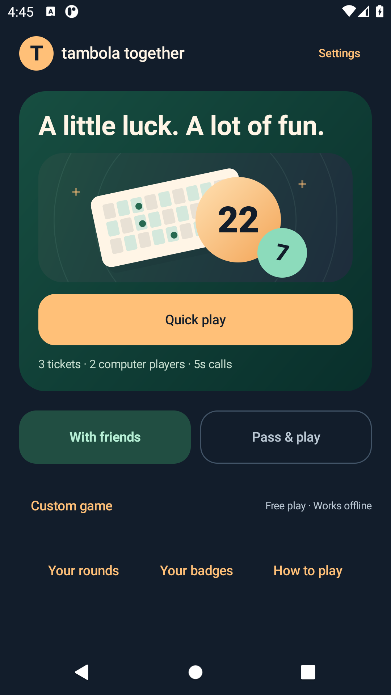
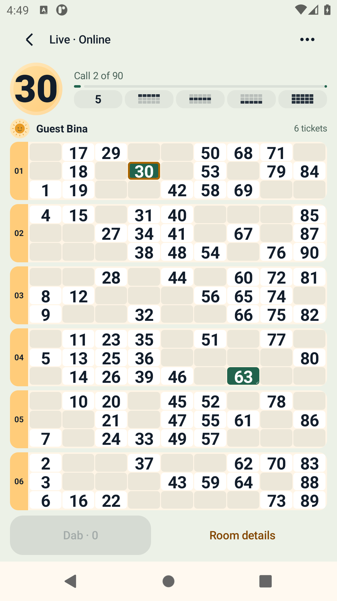

# Alpha13: gameplay redesign candidate

26 September 2026 · branch `shrey/full-tambola-game` · version `0.13.0-alpha13` (13).

This is an internal Android candidate. Public production release remains gated on hosting, signing, operational acceptance and device checks below. Research, screenshots and test logs are retained in [the redesign evidence folder](reviews/gameplay-redesign-2026-09-26/); [the design brief](../docs/GAMEPLAY_REDESIGN.md) records the Play Store review samples, visual references, problems found and iteration decisions.

## What changed

- One-tap Quick play: three tickets, two clearly labelled computer opponents, five-second calls, automatic marking and six common prizes. Existing unfinished rounds resume.
- A complete visible hand of one to six owned tickets, with no ticket carousel or live-table scrolling. Six newly dealt tickets cover 1–90 exactly once; smaller hands contain no repeated number. Different players may share numbers. Existing saved rounds retain their original deal.
- Large caller, paper tickets, visual prize indicators, short number/dab animations and non-blocking win effects. Compact and landscape layouts preserve ticket space; enlarged system text uses accessible playback icons.
- One large manual Dab action marks only confirmed called numbers, without accidentally unmarking on repeated taps. Family handoff pauses calling and removes the prior player's hand before choosing another player.
- Collapsed advanced setup/lobby descriptions, consistent tutorial controls, English/Hindi copy, light/dark themes and shared offline/online table components. Obsolete modal ticket editors and expanding celebration cards were removed.

## Validation and evidence limits

The debug APK SHA-256 is **`bb73f3632176bfbcd6bda8b1585b834eb5741655f7b1274def7b9ccccb19447b`**. The [candidate record](reviews/gameplay-redesign-2026-09-26/candidate.json) also identifies the instrumentation APK and screenshots.

| Check | Result and scope |
| --- | --- |
| JVM tests | 130 passed: 29 domain, 17 client, 77 service, 7 app. Domain coverage includes 10,000 complete strips, every supported hand size at 32-player capacity, deterministic seeds and legacy saves. Service integration used isolated PostgreSQL on loopback; its fresh run took 3m 46s. |
| Broad native regression | Initial API30 run reported 39 cases: seven online cases intentionally required a separate opt-in run, 30 passed, two found a Hindi back-label mismatch and a test capitalization mismatch. Both were corrected and their focused reruns passed. The broad run preceded the final wording/fixed-height footer corrections. |
| Gameplay UI candidate | Four play-experience tests pass: one-tap automatic play, all 1–6 hand sizes, non-overlapping cards, idempotent dabs, saved-state recreation and private family handoff. |
| Layout UI candidate | 48 combinations pass on API30: 360×640 at normal/200% text, 411×731 at normal text, 640×360 landscape; each checks English/Hindi, dark/light, and 1/3/6 cards. Minimum number-box height and 48dp action targets are checked, as well as screen bounds. Actual native screenshots were reviewed and defects corrected. |
| Actual arena animations | Pass with system animations on and off. Calls appear immediately; number motion ends; reduced motion stays still; calls and verified awards preserve ticket positions. |
| Native online regression | Four real-service Android tests pass: a forced Ready race that recovers peer readiness but requires review after changed rules, a 90-call host round with an independent HTTP/WebSocket peer, a six-ticket native guest with private cards and preserved marks after catch-up, and confirmed deletion after a deliberately lost response without altering the offline round. Three invitation tests and Hindi pending-deletion recovery also pass. The fixture stopped its owned processes and removed its reverse mappings. |
| Independent native devices | API30 host and API36/16KB guest completed 90 calls with matching awards, scores and draw audit; only their own two tickets were exposed. Both started a rematch with new grids and retained rules, cancelled it through the host UI and retained both histories. Exact final APK; owned fixture stopped and settings/mappings restored. |
| Final Android 16 gameplay | All four PlayExperienceTest methods also pass on API36/16KB with the final APK (42.05s). |
| Cold-process recovery | Both draw and profile-deletion cases pass on the exact final APK: deliberately dropped committed responses, force-stop, new PID, original pending identity, authoritative reconciliation and preserved offline progress. No extra draw or repeated deletion. Owned services/mappings and settings were restored. The first attempt stopped on an obsolete scroll assertion before the process kill; the updated test rerun passes. |
| Build/lint | Debug and optimized release APK/AAB builds pass. Debug/release lint report zero errors; remaining warnings are unused resources, API-conditional locale metadata and the existing kapt recommendation. Release outputs are unsigned and have no hosted service configured. They are compilation artifacts, not upload-ready releases. |
| Android 16 / 16KB pages | 12 additional combinations pass on the API36 emulator with confirmed 16,384-byte pages: 360×640 at 200% text, English/Hindi, dark/light and 1/3/6 cards. Original display and animation settings were restored. [Evidence](reviews/gameplay-redesign-2026-09-26/api36-large-text-layout.json). |

The 60 layout combinations and screenshots use UI candidate `68d85e46d8e15173790eeb33f92a520168cc6b916117a5fb52650e3a1ae3d711`. The final candidate adds guarded Ready-race recovery without changing UI. The first two-native-device run exposed this race and failed; it is retained as defect evidence. Three client policy tests and a forced native race now pass. Ready agreement is saved alongside the pending request; only a definitive stale-revision rejection with unchanged rules, roster, avatars, host and lock may create a new request, bounded to three retries. Uncertain responses keep their original request identity.

These are incremental validation runs, not a claim that every older test was rerun against a single signed production artifact. The original broad run plus corrected/online reruns cover 39 unique native methods, with an additional actual-arena motion method checked in both animation settings and the added native Ready-race regression. Release compilation and debug/release lint pass after a concurrent generated-stub lint failure was resolved by running lint after compilation. Device/real-network performance is not established by emulator timing.

## Native preview

| Home | Complete six-ticket hand |
| --- | --- |
|  |  |

Also see [200% text on a small phone](reviews/gameplay-redesign-2026-09-26/screenshots/small-large-text-six.png), [Hindi/light](reviews/gameplay-redesign-2026-09-26/screenshots/hindi-light-six.png), and [landscape](reviews/gameplay-redesign-2026-09-26/screenshots/landscape-six.png). Names and rooms are fictional local test fixtures.

## Still required for public release

- A production service/domain, verified HTTPS invitation links, operator/support identity, privacy/store declarations, production signing and a configured signed APK/AAB.
- Fresh sustained-load acceptance for the new candidate. The previous nine-round soak was interrupted after five complete rounds; it is not a passing sustained gate. Real mobile-network latency, network-byte and device frame/jank measurements remain open.
- Release-build device acceptance, plus physical-device audio/TalkBack, native-speaker review and platform/API coverage. Some older fixtures have been migrated in source but have not yet been rerun for this candidate.
- The separately tracked build-tool advisory update and final dependency/provenance checks, hosted backup/restore and monitoring drills.

The installable internal APK is `releases/0.13.0-alpha13/Tambola-Together-0.13.0-alpha13.apk` (42,862,676 bytes), with a matching `SHA256SUMS.txt`. Its APK v2 signature verifies with the existing Android Debug certificate; this is not production signing.

The internal APK uses the loopback development endpoint. Solo/family play work without a backend; private rooms on an ordinary phone need the configured service. No claim of market superiority or production readiness is made from the research sample or local tests.
