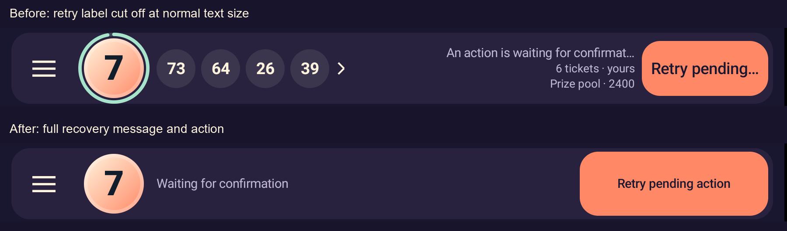
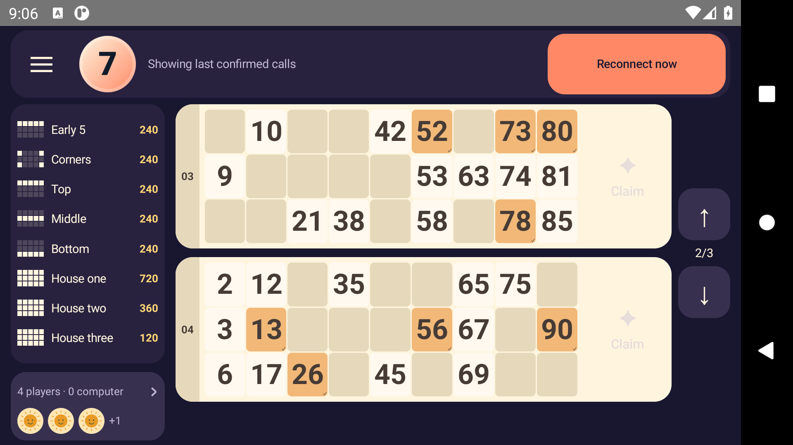

# Active-round recovery — 27 September 2026

Alpha34 makes the recovery action readable when an online round loses its connection or awaits a command receipt. It reuses the landscape header and keeps the portrait footer at a stable height, preserving ticket positions, page selection and saved marks. Disconnection hides the stale deadline ring, disables claims and closes an already-open prize picker. Previously confirmed calls can still be marked. **Reconnect now** and **Retry pending action** call their existing, separate recovery paths; busy requests disable the action.

The old 110dp landscape footer shortened the normal-size English retry label to **Retry pending…**. The [baseline screenshot](baseline/recovery-baseline-en-landscape-100.png), [rendered text geometry](baseline/recovery-baseline-en-landscape-100-geometry.txt) and [failing test](baseline/instrumentation.txt) reproduce actual ellipsis. A second regression reproduced an open prize picker remaining visible after claims became unavailable: [failure](picker-loss/instrumentation.txt).

The Game UI Frontend and Game Playtest skills guided contextual feedback, stable ticket targets and screenshot-plus-interaction checks. Earlier rival observations remain in the [friends-play review](../friends-replay-2026-09-27/README.md); this iteration adds no new competitor gameplay claim.

## Native verification

Nineteen final native test executions pass on the owned API30 emulator. The twelve layout executions cover four English/Hindi × portrait/landscape methods, followed by seven existing manual-ticket and claim-feedback regressions.

| Run | Portrait width / system text | Result |
| --- | --- | --- |
| [balanced-large](balanced-large/instrumentation.txt) | ~411dp / 200% | 4 passed, 32.491s |
| [balanced-normal](balanced-normal/instrumentation.txt) | ~411dp / 100% | 4 passed, 31.889s |
| [balanced-narrow](balanced-narrow/instrumentation.txt) | 320dp / 200% | 4 passed, 31.407s |
| [regressions](regressions/instrumentation.txt) | Standard viewport / 100% | 7 passed, 44.036s |

Each recovery case checks the actual Activity and rendered text scale, full action/status line geometry, unchanged selected-ticket bounds, page and marks, claim disabling, picker dismissal and deadline-ring removal. It checks reconnecting, connecting, suspended, pending and busy states, verifies that the correct callback alone is invoked, and restores live claims and the ring. Settings and installed Wi-Fi/beta APK identities are restored or retained after every run. The review package is isolated and does not register a guest or issue a game command. [Run and source identities](native-summary.json), [historical runner](run-native-review.mjs), [build configuration](ui-review.init.gradle).

The review APK retains version 33; its four affected UI source files match optimized alpha34. The historical runner pins the then-installed alpha33 beta and must be adapted before use against a newer package. Screenshots were inspected as well as asserted: [Hindi landscape at 200%](balanced-large/recovery-balanced-large-hi-landscape-200-pending.png), [narrow Hindi landscape](balanced-narrow/recovery-balanced-narrow-hi-landscape-200-pending.png), [English portrait recovery](balanced-large/recovery-balanced-large-en-portrait-200-reconnecting.png). Other existing arena labels still truncate at 200% text; this is acceptance of the recovery controls and stable hand, not full-arena accessibility or TalkBack acceptance.

## Corrections during verification

The first candidate made the action wider but retained a 52dp footer. It passed four normal-text cases, then failed three of four large-text cases: Hindi retry text exceeded its height, and both portrait ticket frames shifted by about 3dp per ticket when the live clock's inherited line height made its footer taller. [Intermediate large-text failures](final-large/instrumentation.txt). An explicit clock line height and a consistent 56dp online coin footer fix both measurements; the final three matrix runs above pass.

An intermediate build failed because a scripted edit placed a room-dependent footer height in the offline arena. That edit was corrected before successful build and acceptance; [failed build](balanced-build.txt), [corrected build](balanced-fixed-build.txt). The screenshot helper also gained `waitForIdle()` before capture: an earlier pending screenshot could show the preceding reconnect frame because elapsed wall time did not flush Compose's test clock. Final accepted screenshots capture the asserted state. Intermediate runs are retained and excluded from the 19 accepted executions.

The first optimized public run failed after 268.383 seconds while waiting for `round-reconnect`. Wi-Fi/data settings read zero, but a separate [network diagnostic](network-diagnostic.json) showed Android still retaining a connected, validated Wi-Fi route. Its Wi-Fi status command also stopped responding. The initial driver checked settings only, so that attempt did **not** establish a real outage or prove an app recovery defect. [Transcript](initial-public-failure/instrumentation.txt), [journey and four-profile cleanup](initial-public-failure/coin-release-journey.json), [exact app/driver identities](initial-public-failure/validation.json). The failure screenshot was captured after network settings were restored and cannot establish what the app showed while they were disabled.

Only the owned emulator was rebooted; the PC service and app APK were unchanged. A subsequent [network preflight](network-preflight.json) verified a transition from an active route to none and back, with settings restored. The external driver now requires `ConnectivityManager.activeNetwork == null` before checking recovery, requires a live network after restoration, and captures any outage failure before restoring settings. Its additional network-state permission belongs only to the test driver. [Revised driver build](driver-build.txt). The driver remains restricted to the owned emulator and restores its Wi-Fi/data settings in `finally`.

## Android browser handoff remains open

An attempted launch of the invitation in the owned emulator's Chrome through adb was rejected by automatic approval review with **“blocked by policy”**, with no more specific reason. No part of that command ran. The supported browser-control inventory then returned no surfaces and `unsupported Codex auth method: apikey`. No Chrome onboarding, account or profile changes were made, and the blocked launch was not rerouted through another driver.

Chrome's [Android intent guidance](https://developer.chrome.com/docs/android/intents) describes an explicit user gesture and a browser fallback. Existing desktop browser fixtures verify the generated fixed-package intent and fallback only. They do not establish Android browser-to-app handoff. Physical-phone/mobile-data, TalkBack, native competitor gameplay, frame performance, production signing, Figma updates and high-load latency remain open.

## Build and invitation checks

The optimized publicBeta APK and external driver build successfully. Eighteen Android JVM tests and 71 web tests pass. Lint reports zero errors and 123 warnings. English/Hindi catalog checks pass for all 800 resources. [Build](android-build.txt), [test summary](test-summary.json), [web results](web-tests.txt).

APK SHA-256: `12c777f7ef1001d6c67a0e62ecda0e08c5b147829d0e07c651c5bc34485ee916`; 29,192,565 bytes; package `io.github.sbshrey.tambola.game.beta`; version 34 / `0.34.0-alpha34-internet-beta`. The optimized package is not debuggable and verifies with the same development signing certificate. [APK identity](apk-identity.json). An evidence collector initially ran just before Gradle printed its final success line and stopped on its success-log assertion; it was rerun after the build completed, without another build or APK change.

The [desktop browser fixture](browser/validation.json) passes the legacy caller-worker upgrade, caller offline retention, code validation/copy, keyboard navigation, English/Hindi at normal/200% text and exact alpha34 intent/download fallback. Its scope remains separate from the blocked Android browser check.

## Exact public acceptance

The unchanged optimized APK passed the revised `InternetBetaTest#friendsRoundRecovery`: **OK (1 test), 486.98 seconds**, using the public directory and system-trusted HTTPS/WSS with no adb reverse. The native player and three passive HTTP QA peers completed **87 calls and all eight prizes**. Public winning-ticket shares accounted for the full 2,400-coin pool; the native balance finished at 3,300 and aggregate balances remained 6,000. [Journey](public-round/coin-release-journey.json), [transcript](public-round/instrumentation.txt), [exact app and revised-driver identity](public-round/validation.json).

At call 30, the emulator lost its active network. The app dismissed the picker, disabled claims, hid the deadline ring and showed the full reconnect action without changing ticket geometry or page. Marking a saved call off and on worked offline. Explicit reconnect restored the same room, round, ticket counts, pool and mark by call 31. [Disconnected screen](public-round/round-network-disconnected.png), [restored screen](public-round/round-network-restored.png). This proves the active disconnect path; pending-request callback/label behavior is covered by fixtures, not a new production response-loss injection.

All 20 saved marks and the ticket page survived process death; call history was verified before and after reopening. Same friends replay placed the native player and peer in the same next lobby with three/two tickets, verified the exact peer receipt and process recovery, then refunded both purchases. All four QA profiles were deleted. The emulator's network, font, animation and density settings were restored, the Wi-Fi APK stayed unchanged, and the owned emulator was stopped. [Cleanup](emulator-cleanup.json).

The installed PC service/runtime identities remained unchanged, with no bridge or service restart. [Host verification](host-verification.json), [public endpoint check](public-entry.json). This is an automated functional round on an owned emulator, not independent remote-human, physical-phone, mobile-data or frame-performance acceptance.

## Publication

The [alpha34 prerelease](https://github.com/sbshrey/tambola-caller/releases/tag/full-game-alpha34-round-recovery) targets source commit `790b9d8628592d6193c342bb2e1c9ebae031b9b9`. Its [APK download](https://github.com/sbshrey/tambola-caller/releases/download/full-game-alpha34-round-recovery/Tambola-Internet-Beta-0.34.0.apk) was fetched anonymously and matched the tested SHA-256 and 29,192,565-byte size.

The guarded publisher created main commit `e3a6b9df16175927c67b54864a2b8a11f60dc748`; actual changes are limited to `friends/index.html` and `friends/invite.js`. Pages build `1243295010` completed successfully. At **16:02 UTC**, normal public URLs for the invitation assets, stylesheet, service worker and caller homepage matched their reviewed local content. A fresh Chromium session checked the code display, English/Hindi switch, alpha34 download and explicit intent fallback without page errors. [Publication record](pages-publication.json), [verification](publication-verification.json), [public invitation](published-invitation.png). The public game endpoint also passed its readiness and route checks at 16:01 UTC. These checks do not establish Android browser handoff or physical/mobile-data acceptance; the broader goal remains active.
