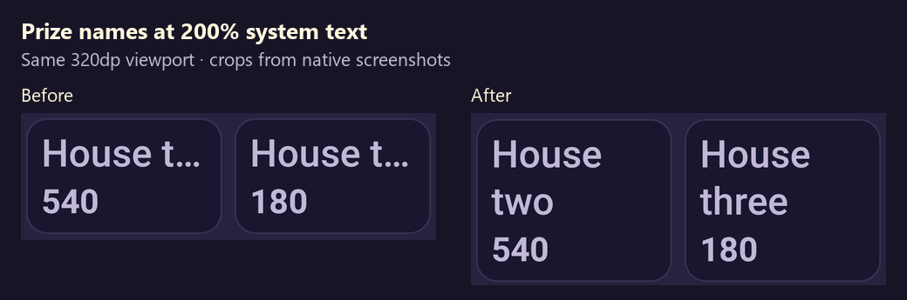

# Readable ticket claim choices — 27 September 2026

At a 320dp portrait width and real 200% system text size, the old picker shortened both House two and House three to **House t…**. Its title and several other prizes also truncated. The [baseline screenshot](baseline-truncated.png) and [failing regression](narrow-baseline/instrumentation.txt) reproduce this with the same test APK used for the final candidate.

Alpha33 wraps the complete title and prize names. Equal-height cards align the amounts within each row. The title and close button stay above a bounded scrolling list, whose height follows the actual title height. The dialog preserves the caller's text scale. Existing ticket identity, claim availability, house ordering and call-boundary rules remain unchanged; this is a presentation change.

The Game UI Frontend skill guided readable labels, hierarchy and a compact secondary view. This follows Android's guidance on [scalable content](https://developer.android.com/develop/ui/compose/accessibility/scalable-content). No new artwork or visual theme was needed. Earlier rival observations remain in the [friends-play review](../friends-replay-2026-09-27/README.md); this work fixes a reproduced issue in our own picker and adds no new competitor gameplay claims.

## Native verification

The final UI passed **19 native test executions** on the owned API30 emulator: twelve layout cases across four new test methods, followed by seven existing ticket/claim regression tests.

| Run | Width / text size | Cases | Result |
| --- | --- | --- | --- |
| [aligned-large](aligned-large/instrumentation.txt) | 320dp portrait width / 200% | English/Hindi × portrait/landscape | 4 passed, 17.715s |
| [aligned-normal](aligned-normal/instrumentation.txt) | 320dp portrait width / 100% | English/Hindi × portrait/landscape | 4 passed, 17.976s |
| [aligned-wide](aligned-wide/instrumentation.txt) | ~411dp portrait width / 200% | English/Hindi × portrait/landscape | 4 passed, 17.067s |
| [regressions](regressions/instrumentation.txt) | Standard viewport / 100% | ManualTableTest and ClaimFeedbackUiTest | 7 passed, 46.471s |

The layout cases assert the actual Activity and rendered Text font scale, complete line geometry, accessible prize/amount labels, reachable close control and minimum touch targets. They scroll to every choice, verify the locked second/third houses and submit Bottom line for exactly the sixth ticket. The seven regressions cover manual marking, selected-ticket behavior and existing claim feedback. These tests use a separate review package and retain the installed Wi-Fi and beta APK hashes unchanged. System font, animation and density settings are restored after each run. [Identity and source hashes](native-summary.json).

The debug review APK retained version 32; its UI source exactly matches optimized alpha33. It is not the public APK. [Historical runner](run-native-review.mjs) and [build configuration](ui-review.init.gradle) record the invocation; the runner intentionally requires the then-installed alpha32 beta and should not be run unchanged against a newer beta.

[English portrait at 200%](english-portrait-top-200.png), [distinct house labels at 200%](english-portrait-houses-200.png), [Hindi portrait](hindi-portrait-200.png), [Hindi landscape](hindi-landscape-200.png), [English landscape at 100%](english-landscape-100.png). Screenshots were inspected in addition to assertions. Larger text requires scrolling; partial offscreen rows in these images are expected. The gray background belongs to the isolated component fixture.

## Diagnostic corrections

The first wider Hindi check reported `TextLayoutResult.hasVisualOverflow` even though the screenshot was readable. Its paragraph retained a wider measurement constraint than the final Text width. The corrected test inspects each rendered line for ellipsis, horizontal bounds and bottom bounds with a one-pixel tolerance. The [original metadata failure](baseline-confirmed/instrumentation.txt) and [readable screenshot](wide-baseline-readable.png) are retained and are **not** counted as an app defect. The corrected test subsequently reproduced actual English ellipses at 320dp before the production change.

Two harness setup issues were corrected: trimming an extra carriage return in the AVD name, and accepting Android's normalization of an absent `font_scale` setting to its effective default 1.0. Later runs restore 1.0 exactly. An initial evidence collector used Windows' default encoding for a Hindi transcript; specifying UTF-8 fixed collection without changing or rerunning the tests. Intermediate wrapping screenshots were reviewed before equal-height rows were added; only the final three matrix runs count toward acceptance. The baseline, corrected-test, first-candidate and final build logs are retained.

The first optimized public round failed after 409.103 seconds with `Selected prize disabled within the same call`. Its [screen](initial-public-failure/coin-release-failure.png) shows ticket 2 already holding House one and correctly locked out of later house prizes. The driver recorded four call rollovers but retained used house-ticket ordinals only when it observed an award inline after a click; a receipt arriving later could be missed. The initial driver did not log the attempted prize, so the exact selection cannot be reconstructed from that transcript alone. [Failed journey and cleanup](initial-public-failure/coin-release-journey.json), [transcript](initial-public-failure/instrumentation.txt), [APK/driver identities](initial-public-failure/validation.json).

The driver now derives closed house winners from each current public snapshot and logs the selected prize, ticket, call, revision and excluded house tickets. It still fails on an unexpectedly disabled control; it does not bypass the app's availability checks or silently retry a claim. Three deterministic selection checks pass in 0.035 seconds, including a receipt first observed on a later call, current-call house closure and separation of other players/non-house wins. [Selection tests](driver-selection-tests.txt), [driver build](driver-build.txt). All four profiles from the failed round were deleted. The app source and APK bytes were unchanged before the full-round retry. Text transcripts are retained with normalized UTF-8 line endings and trailing whitespace.

## Build and web checks

The optimized publicBeta APK and external driver build successfully. **18 Android JVM tests** pass. Lint reports **zero errors and 123 warnings**. English/Hindi catalog validation passes for all 798 resources. [Build](android-build.txt), [test summary](test-summary.json).

APK SHA-256: `e318900b61708846db7bd6010f3091f420d8e95efdcbff739d287aa6465d1583`; 29,192,205 bytes; package `io.github.sbshrey.tambola.game.beta`; version 33 / `0.33.0-alpha33-internet-beta`. Signature verification passes with the existing development certificate, and the optimized APK is not debuggable. [Identity](apk-identity.json).

All **71 web tests** pass. The invitation browser fixture verifies the legacy caller-worker upgrade, offline caller retention, exact alpha33 intent/download fallback, code validation/copy behavior, keyboard navigation and English/Hindi at normal/200% text. [Web tests](web-tests.txt), [browser verification](browser/validation.json).

## Public acceptance

The exact optimized APK passed the repeated `InternetBetaTest#friendsHistory`: **OK (1 test), 473.697 seconds** through the public directory and system-trusted HTTPS/WSS, without adb reverse. The native player and three passive HTTP QA peers completed **85 calls and all eight prizes**. Public winning-ticket shares accounted for the full 2,400-coin pool; the native balance finished at 3,300 and aggregate balances remained 6,000. History was checked against revealed server calls before and after process death; all 20 saved marks and the selected ticket page were retained. [Journey](public-round/coin-release-journey.json), [transcript](public-round/instrumentation.txt), [exact app and revised-driver identity](public-round/validation.json).

House two used ticket 4 after excluding House one's ticket 6. The final round completed every ranked house. Same friends replay placed the native player and a peer together with three/two tickets, checked the exact peer receipt and process recovery, then refunded both purchases. All four QA profiles were deleted. The owned emulator was stopped after confirming restored settings, the unchanged Wi-Fi APK and the expected alpha33 beta. [Cleanup](emulator-cleanup.json).

At 15:15 UTC the public endpoint remained healthy and the configured installed server/runtime hashes matched their earlier values. No host service or bridge restart was performed. [Public entry](public-entry.json), [host identity](host-verification.json). This is an automated functional round on the owned emulator, not independent remote-human, physical-phone, mobile-data or frame-performance acceptance.

## Publication

The tested APK is prepared for the [alpha33 prerelease](https://github.com/sbshrey/tambola-caller/releases/tag/full-game-alpha33-readable-claims). Public asset and invitation-page verification will be recorded after publication.

Physical-phone/mobile-data/TalkBack acceptance, native competitor gameplay, frame performance, production signing, editable Figma updates and high-load latency remain open. The broader goal remains active.
