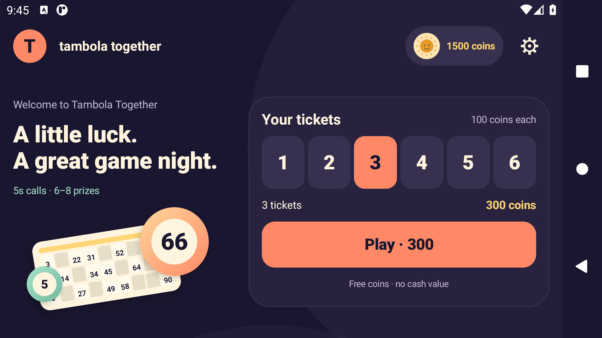
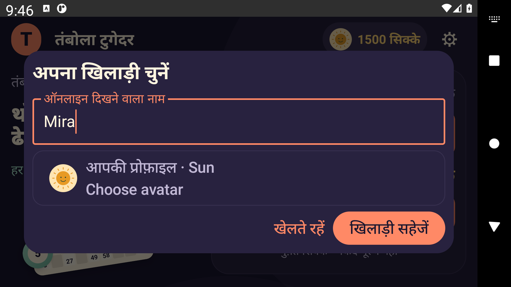

# Game night native welcome and lobby

27 September 2026. Implements the working Game night direction from the [editable Figma board](https://www.figma.com/design/MY3fG0NL8iLCs8sIZz9xqt/?node-id=3-1215). [Browser review and design sources](../../../designs/landscape-lobby-v1/README.md) remain the feedback path without repeatedly installing the main APK. The optional Game night/Daylight preference is still open.



## Implemented

- Indigo/plum background, cream text, coral Play and ticket selection, mint/gold accents, and original numbered ticket/ball artwork.
- One purchase panel: six ticket quantities, selected count, visible total and Play. No required registration form. Returning players get a shorter greeting.
- Optional name/avatar setup preserves the selected quantity. Pending purchase state exposes receipt recovery and removes the new-purchase controls.
- A finite 650 ms artwork entrance, with reduced-motion support and no idle animation loop or media download.
- Existing results, affordable replay, free refill, privacy and destructive-action confirmations remain connected to the existing model. No API, wallet or server rule changes.
- All-screen `sensorLandscape` from the earlier orientation change is exercised through actual MainActivity launch, Settings and return to home. System bars match the lobby palette.

## Checks and evidence

The debug `.uireview` application and test package were installed alongside the Wi-Fi candidate on the owned API 30 software emulator, `emulator-5582`, 1920×1080 landscape at 420 dpi. The review build uses the explicit [Gradle init script](../../tools/ui-review.init.gradle); ordinary release builds do not receive its application ID suffix.

| Check | Result |
| --- | --- |
| Debug app and instrumentation assembly | Passed |
| Android JVM tasks | 15 tests, five classes, no failures/errors/skips |
| Debug lint | No errors; 88 warnings |
| Native UI, system text 100% | Nine tests passed |
| Native UI, actual system text 150% | The same nine tests passed |
| Original Wi-Fi APK identity | Same SHA-256 before and after both runs |
| System text restoration | Restored to its original 1.0 value |

[Validation summary](validation-summary.json) contains the exact source hashes, APK hashes, lint counts and identities. [Gradle output](gradle-validation.txt), [normal instrumentation](normal/instrumentation.txt), [large-text instrumentation](font150/instrumentation.txt), raw lint XML and JUnit reports are retained. Gradle can reuse unchanged JVM task outputs; these are not presented as a new server regression run.

The eight `CoinLobbyTest` fixtures cover English/Hindi welcome and returning states, all six quantity controls with at least 48 dp targets, 600-coin selection, optional name entry, preserved selection after simulated profile creation, one Play callback, receipt recovery, personal shared rewards, countdown, affordable replay and free-refill states. The ninth test opens actual MainActivity and navigates Settings/home in landscape.

Screenshots revealed a problem beyond the first passing fixture run: the keyboard collapsed the profile input, and the initial repair still left the actions behind the keyboard. A full-window dialog now applies drawing and IME insets, simplifies its header while the keyboard is open, and keeps the input and both actions visible. Tests now assert the input's visible height and displayed actions. Decorative illustration numbers also keep their drawn size while actual UI text follows the user's scale.



Final screenshot inspection covered the actual welcome, returning lobby, Hindi/English keyboard forms, pending recovery and results. The 150% welcome may truncate its secondary greeting; the six choices, cost and Play remain visible. The new Modifier lint warning found during this work was fixed, leaving the earlier 88 warnings, including Android's fixed-orientation advisory.

## Reproduce

From `full-game`, using the configured JDK 17 and Android SDK:

```powershell
.\gradlew.bat -I tools/ui-review.init.gradle :app:assembleDebug :app:assembleDebugAndroidTest :app:testDebugUnitTest :app:lintDebug --console=plain
node reviews/game-night-lobby-2026-09-27/run-native-review.mjs
node reviews/game-night-lobby-2026-09-27/run-native-review.mjs --large-text
```

The runner deliberately requires the named Tambola emulator, checks the review APK's actual manifest package before installation, and verifies the original alpha22 hash. It never uninstalls or clears app data. It temporarily sets 150% system text for the second invocation and restores the previous value in `finally`. It runs only the nine listed UI tests, then stores screenshots and identities under `.test-workspace`.

## Scope and remaining work

This is a native design checkpoint, not a production APK or a fresh online round acceptance. Fixture state and callback assertions do not prove server registration, a network ticket purchase, settlement, avatar persistence or recovery. The actual activity test does not register a player or spend coins. The unchanged installed alpha22 retains its separately recorded online/endurance evidence.

The live ticket/claim arena has not received the new visual treatment. Physical-phone reachability, cutouts, OEM/Android 16 orientation behavior, audio, frame performance, server burst latency and release signing remain open. The older orientation warning is deliberately not hidden. No physical phone was attached during these checks.

The installed Wi-Fi APK stays at SHA-256 `05dfaa405629fec0a5ab57234941eca1229b9f2cb13034a496e3549759bdb4b4`. The [host health snapshot](host-health-before-archive.json) at 04:12:29 UTC reports HTTPS 200/ready, protocol 4, source `b6d5eb6` and unchanged runtime `f2b39e5`. No host deployment was performed for this UI work.
